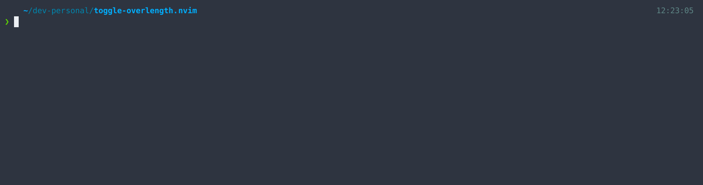

# toggle-overlength.nvim

A Neovim plugin to toggle the highlithing of text exceeding the
column length.



# Installation

Install the plugin with your package manager:

[lazy.nvim](https://github.com/folke/lazy.nvim):

Here default configuration with a column length of `120`.

```lua
{
    "fouladi/toggle-overlength.nvim",
    config = function()
        require("toggle-overlength").setup({})
    end,
}
```

Use other column lengths and colours if you prefer, for example:

```lua
{
    "fouladi/toggle-overlength.nvim",
    config = function()
        require("toggle-overlength").setup({
            column_length = 80, -- Set column length to 80
            ctermbg = "red", -- Set terminal background color to red
            guibg = "#ff0000", -- Set GUI background color to red
        })
    end,
}
```

# Usage

After setup, the following commands will be automatically applied. Note
that this command is used in toggle mode. This means that you can turn
the highlighting on and off with the same command.

### Commands:

Custom commands `:ToggleHiOverLength` to toggle the highlighting.

### Key Mappings:

Optional key mappings are provided to quickly toggle (`<leader>th`) the
highlighted rows.
