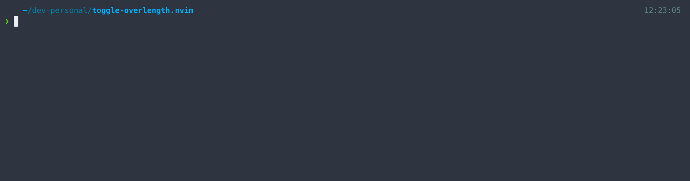

# toggle-overlength.nvim

A Neovim plugin to toggle the highlighting of text exceeding the
column length.



# Installation

Install the plugin with your package manager:

[lazy.nvim](https://github.com/folke/lazy.nvim):

Default configuration with a column length of `120`:

```lua
{
    "fouladi/toggle-overlength.nvim",
    config = function()
        require("toggle-overlength").setup({})
    end,
}
```

Custom column length, colours, and keymap:

```lua
{
    "fouladi/toggle-overlength.nvim",
    config = function()
        require("toggle-overlength").setup({
            column_length = 80,      -- Set column length to 80
            ctermbg = "red",         -- Set terminal background color to red
            guibg = "#ff0000",       -- Set GUI background color to red
            keymap = "<leader>th",   -- Optional: set a toggle keymap
        })
    end,
}
```

# Usage

After setup, the `:ToggleHiOverLength` command is available. It works as
a toggle — the same command turns highlighting on and off.

### Command

`:ToggleHiOverLength` — toggle overlength highlighting for the current window.

### Key Mapping

No keymap is set by default. Pass `keymap` in the setup options to bind one:

```lua
require("toggle-overlength").setup({ keymap = "<leader>th" })
```
